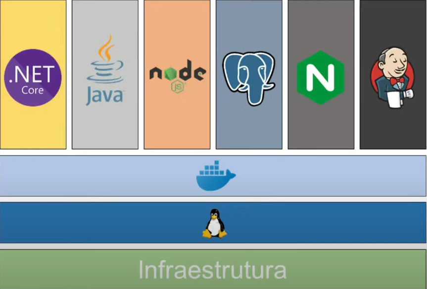
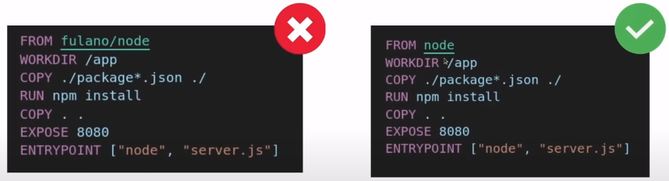
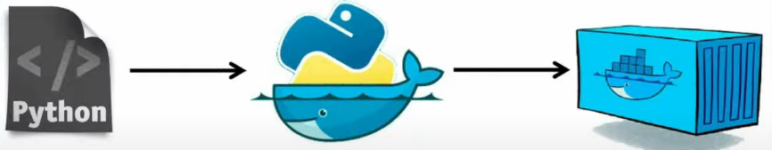

# AULA 1 - CONTAINER E DOCKER SIMPLIFICADOS

### Importância de Container e Kubernetes

* Crescimento da adoção da arquitetura de microsserviços (Container e cultura DevOPS)

* Facilitar a transição entre os ambientes de desenvolvimento > homologação > produção 

* Maior produtividade para as equipes de desenvolvimento e infraestrutura

* **Kubernetes** é agnósticos, ou seja, roda em vários lugares, e não de depende de linguagem de programação

### Container

* **Definição**

  * Isolar processos em um ambiente para prevenir possíveis erros (conflitos de configuração ou de ferramental)

* **Vantagens**

  * Padrão de execução

  * Acaba o problema de "Mas na minha máquina funciona"

* **Conceitos importantes**

  * **Containerização e Virtualização**

    * Na virtualização

      

      * **Problemas**

        * Para cada máquina há a necessidade de instalar e gerenciar o sistema operacional

        * Alto custo (quantidade de recursos que o sistema operacional consome)

        * Lentidão na inicialização da máquina

    * Na containerização

      

      * **Vantagens**

        * Simplificação de gestão (1 único sistema operacional e os _container runtime_ o simula)

        * Economia de recurso

        * Rapidez na inicialização da máquina

      * Ferramenta mais utilização: **Docker**

### Docker

* **Definição**

  * Ferramenta para facilitar o gerenciamento de containers

  > OBS: Docker não criou o container (conceito antigo no Kernel), mas criou um ferramental para facilitar a sua manipulação

* **Utilização**

  * É preciso ter 2 objetos básicos: **imagem** e **containers**

* **Conceitos**

  * **Imagem** 
    
    * **Introdução**

        * São _templates_ (**molde**) utilizados para a criação e execução de um container

          

        * A criação de imagens Docker utiliza a tecnologia de **Overlay Filesystem**, do Linux

        * Existem 2 formas de construir um imagem: **Docker Commit** ou **Dockerfile**

    * **Overlay Filesystem**

      * **Definição**: é a combinação e agrupamento de camadas de arquivos do sistema (de somente leitura)

      * **Função no Docker**: cada instrução (formará arquivos, seja criando ou copiando), no **Dockerfile**, corresponde a uma camada de *file system*. Dessa modo, o empilhamento dessas camadas de *file system* forma a **imagem Docker**

      * **Representação**

        

      * **Vantagens**

        * **Reaproveitamento de espaço**

          * Exemplo em imagens

            

          * Exemplo em containers

            
    
    * **Formas de criação de imagens**

      * **Docker Commit**

        * **Definição**: criação da imagem a partir de um container, ou seja, (imagem base utilizada no container + comandos + manipulações de arquivos, cópia/criação)

        * **OBS**: não é recomendado essa forma pelo seguintes motivos:

          * **Não é possível o versionamento**

          * **Difícil de se reproduzir/distribuir** (pelo fato de ser criado a partir de um container, a execução das instruções é feita em tempo real, portanto não tem um forma de versionamento)

          * **Difícil a automatização de processos** (como consequência do tópico anterior)

        * **Exemplo**: ir para o título `Exemplo: Criar um container com Ubuntu e curl`

      * **Dockerfile**

        * **Definição**: é uma "receita" de criação de imagem. As instruções especificadas na "receita" (Dockerfile) serão executas na ordem, e no final será criado a imagem

    * **Boas práticas na criação de imagens**

      * **Convenção de nomenclatura da imagem**

        * `<namespace>/<repositório>:<tag>`

          * `namespace` = usuário no Docker Hub (Docker ID), proprietário da imagem

          * `repositório` = nome do repositório no Docker Hub

          * `tag` = versão da imagem

            > O Docker pega a tag **latest** da imagem caso o mesmo não for especificado no comando. Por isso a importância de criar essa tag ao dar *push* no *Docker Hub*

        * **Exemplo**: `imgabreuw/conversao-temperatura:v1`

        * **OBS**: em algumas imagens não tem o namespace, ou seja, o proprietário dela. Isso ocorre em imagens oficiais, no qual o proprietário da imagem é o próprio Docker
        
          * **Exemplo**: `ubuntu:20.10`
    
      * **Imagens oficiais**

        * Preferência por imagens oficiais

          

      * **Tags na imagens**

        * Sempre especificar a tag nas imagens

          

        * Quando não é especificado uma tag, por padrão, é utilizado a versão latest (não garante a idempotência na execução do container)

      * **Um processo por container**

        * De preferência optar por **colocar um serviço por container** (em caso de serviços interdependentes, pode-se colocar em um único container), afim de garantir a escalabilidade e granularidade fornecido pelo container

          

      * **Aproveitamento das camadas de imagem**

        * Ganho de desempenho na criação da imagem

          

      * **Arquivo `.dockerignore`**

        * Tem a mesma função do `.gitignore`. Os arquivos especificados nesse arquivo serão ignorados no processo de `COPY` do Dockerfile

          ```
          # .dockerignore
          node_modules/
          ```

          > **OBS**: colocar esse arquivo no mesmo diretório do Dockerfile (diretório raiz do projeto)

      * **`COPY` vs `ADD`**

        * `COPY`: copiar arquivos local para o container

        * `ADD`: copiar arquivos local para o container + arquivos compactos + baixa e adicionar ao container arquivos na nuvem (para baixar)

      * **`ENTRYPOINT` vs `CMD`**

        * `ENTRYPOINT`: a execução do comando de inicialização do container é imutável, ou seja, não é possível sobrescreve-lo

        * `CMD`: a execução do comando de inicialização do container é mutável, ou seja, é possível sobrescreve-lo. Além disso, o `CMD` pode ser passado no `ENTRYPOINT`, como argumento

      * **Argumentos na construção de imagens**

        * **Dockerfile**

          ```dockerfile
          ARG TAG=latest
          
          FROM ubuntu:$TAG

          RUN apt-get update && \
              apt-get install curl --yes
          ```

        * **Comando para criação da imagem, passando o argumento `TAG`**: `$ docker build -t imgabreuw/ubuntu-curl-arg:v1 --build-arg TAG="18.04" .`

      * **Multistage build**

        * **Contextualização: Tipos de linguagem de programação**

          * **Interpretadas**

            

            * **Definição**: o código fonte é interpretado por um software para então ser executada

            * **Exemplos**: JavaScript, Python

          * **Compiladas**

            

            * **Definição**: o código fonte é convertido em um arquivo binário (executável) no qual será executado em um determinado sistema operacional

            * **Exemplos**: Go, C

          * **JIT (Just in Time)**

            * **Definição**: o código fonte é interpretado por um software e é transcrita em um linguagem intermediário, no qual será compilada e transformada em um arquivo binário (executável)

            * **Exemplos**: Java, PHP (versão 8+)

        * **Exemplo: Golang**

          * **Sem multistage build**

            ```dockerfile
            FROM golang:1.7-alpine3.6

            WORKDIR /app

            COPY main.go .

            RUN CGO_ENABLED=0 GOOS=linux go build -a -installsuffix cgo -o main

            CMD ["./main"]
            ```

            > Tamanho da imagem: 231MB

          * **Com multistage build**

            ```dockerfile
            FROM golang:1.7-alpine3.6 AS builder

            WORKDIR /app

            COPY main.go .

            RUN CGO_ENABLED=0 GOOS=linux go build -a -installsuffix cgo -o main

            FROM alpine:3.14

            WORKDIR /app

            COPY --from=builder /app/main .

            CMD ["./main"]
            ```

            > Tamanho da imagem: 7.23MB

  * **Container**

    * **Definição**

      * É a instanciação de uma artefato (imagem) em execução

        
    
      * É a inserção de mais uma camada, porém com as permissões de leitura e escrita

        

  * **Arquitetura do Docker**

    

    * **Docker daemon**
      
      > Também conhecido como *dockerd*

      * Componente para gerenciar os objetos do Docker (imagens/containers/networks/volumes)

      * Responsável pela execução dos containers

    * **Docker client**

      * Docker CLI faz a comunicação com o **dockerd** a partir de comandos (`docker build`, `docker run`)

        > CLI = (C)ommand (L)ine (I)nterface

    * **OBS**: *Docker daemon* e *Docker client* não precisam estar, necessariamente, na mesma máquina

    * **Docker registry**

      * Repositório de imagens Docker (armazenar e distribuir imagens)

      > Analogamente a um repositório Git

* **Comandos**

  * **Criar um container**

    * **Sintaxe**
      
      * `$ docker container run <imagem>` (forma mais atualizada)

      * `$ docker run <imagem>`

    * **Exemplo**

      * `$ docker container run hello-world`

  * **Listagem de container em execução** 
    
    * **Sintaxe**

      * `$ docker container ls`

      * `$ docker ps`

      * **OBS**: esse comando imprime na tela informações de cada container:

        * ID do container (`CONTAINER ID`)

        * Imagem utilizada no container (`IMAGE`)

        * Comando de execução (`COMMAND`)

        * Data de criação (`CREATED`)

        * Status do container (`STATUS`)

          > O status do container pode ser `Exited` ou `Up`

        * **Binding de portas** (`PORTS`)

        * Nome do container, se não for especificada é gerado de forma aleatório (`NAMES`)

  * **Listagem de todos os containers**
  
    * **Sintaxe**
    
      * `$ docker container ls -a`

      * `$ docker ps -a`

  * **Listagem das imagens**
  
    * **Sintaxe**
    
      * `$ docker image ls`

      * `$ docker images`

  * **Renomear um container**
  
    * **Sintaxe**: `$ docker container run --name <nome> <container>`

    * **Exemplo**: `$ docker container run --name meucontainer hello-world`

  * **Remover um container**
    
    * **Sintaxe**
    
      * `$ docker container rm <id do container>`

      * `$ docker container rm <nome do container>`

      * `$ docker rm <id do container>`

      * `$ docker rm <nome do container>`

    * **Exemplo**: `$ docker container rm meucontainer`

  * **Forçar a remoção de um container**
  
    * **Sintaxe**
    
      * `$ docker container rm -f <id do container>`

      * `$ docker container rm -f <nome do container>`

      * `$ docker rm -f <id do container>`

      * `$ docker rm -f <nome do container>`

    * **Exemplo**: `$ docker rm -f meucontainer`

  * **Criar um container no modo interativo**

    * **Sintaxe**

      * `$ docker container run -it <imagem> /bin/bash`

      * `$ docker container exec -it <id do container> /bin/bash`

    * **Exemplo**: 
      
      * `$ docker container run -it ubuntu /bin/bash`

      * `$ docker container run -it imgabreuw/ubuntu-curl:v1 /bin/bash`

  * **Executar um container em *modo daemon***

    * **Sintaxe**: `$ docker container run -d <imagem>`

    * **Exemplo**: `docker container run -d nginx`

  * **Ligação de portas (*ports binding*) entre máquina local e container**

    * **Sintaxe**: `$ docker container run -p <porta local>:<porta container> <imagem>`

    * **Exemplo**: `$ docker container run -p 8080:80 nginx`

  * **Parar a execução de um container**
  
    * **Sintaxe**
    
      * `$ docker container stop <id do container>`

      * `$ docker container stop <nome do container>`

    * **Exemplo**: `$ container stop meucontainer`

  * **Histórico de construção de uma imagem**
  
    * **Sintaxe**: `$ docker image history <imagem>`

    * **Exemplo**: `$ docker image history nginx`

  * **Remover imagens não utilizadas**
  
    * **Sintaxe**: `$ docker image prune`

    * **Exemplo**: `$ docker image prune`

  * **Remover containers intermediários**

    * **Sintaxe**: `$ docker container prune`

    * **Exemplo**: `$ docker container prune`

  * **Flags**

    * `--name`

      * **Função**: especificar o nome do container

      * **Sintaxe**: `$ docker container run --name <nome do container>`

      * **Exemplo**: `$ docker container run --name meucontainer`

    * `--rm`

      * **Função**: remover automaticamente o container após ter sua execução finalizada (status = `Exited`)

      * **Sintaxe**: `$ docker container run --rm <nome da imagem>`

      * **Exemplo**: `$ docker container run --rm hello-world`

    * `-i` e `-t`

      * **Função**
      
        * `-i`: habilitar o modo interativo

        * `-t`: habilitar o **Docker TTY** (acesso à linha de comando)

      * **Sintaxe**: `$ docker run -it <imagem>`

      * **Exemplo**: `$ docker run -it ubuntu`

    * `-d`

      * **Função**: executar um container em modo daemon, ou seja, em segundo plano (para não travar o terminal)

      * **Sintaxe**: `$ docker container run -d <imagem>`

      * **Exemplo**: `$ docker container run -d nginx`

    * `-f`

      * **Função**: forçar a execução de um comando

      * **Exemplo**
      
        * `$ docker container rm -f meucontainer`

          > No caso acima, a flag `-f` forçará a remoção do container

    * `-e`

      * **Função**: adicionar variáveis de ambientes no container

      * **Sintaxe**: `$ docker container run -e <chave>=<valor> <imagem>`

        > É preciso colocar a flag `-e` antes de cada variável de ambiente

      * **Exemplo**: `$ docker container run -d -p 27017:27017 -e MONGO_INITDB_ROOT_USERNAME=mongouser -e MONGO_INITDB_ROOT_PASSWORD=mongopwd mongo`

    * `-n`

      * **Função**: determinar um número específico de linhas do log, de um container, que serão impressas no terminal

      * **Sintaxe**: `$ docker container logs -n <número de linhas> <ID do container>`

      * **Exemplo**: `$ docker container logs -n 50 37a63afa7185`

    * `--follow` ou `-f`

      * **Função**: acompanhar os novos logs de um container e imprimindo os no terminal

      * **Sintaxe**: `$ docker container logs --follow <ID do container>`

      * **Exemplo**: `$ docker container logs --follow 37a63afa7185`

* **Comandos de *troubleshooting* (comandos de resolução de problemas)**

  * **Inspecionar um container**

    * **Sintaxe**: `$ docker container inspect <ID do container>`

    * **Exemplo**: `$ docker container inspect 37a63afa7185`

  * **Executar um comando / habilitar o terminal em um container em execução**

    * **Sintaxe**: `$ docker container exec -it <ID do container> <comando>`

    * **Exemplo**: `$ docker container exec -it 37a63afa7185 /bin/bash`

  * **Visualizar os logs de um container**

    * **Sintaxe**

      * `$ docker logs <ID do container>`

      * `$ docker container logs <ID do container>`

    * **Exemplo**: `$ docker container logs 37a63afa7185`

  * **Visualizar os logs de um container com a flag `-n`**

    * **Sintaxe**: `$ docker container logs -n <número de linhas> <ID do container>`

    * **Exemplo**: `$ docker container logs -n 50 37a63afa7185`

### Dockerfile

* **Definição**: arquivo que contém todas as instruções necessárias para criar um container

* **Etapas de criação de uma imagem com Dockerfile**

  * **Definir a imagem base**
  
    * **Sintaxe**: `FROM <imagem>`

    * **Exemplo**: `FROM ubuntu`

  * **Rodar um comando**

    * **Sintaxe**: `RUN <comando>`

    * **Exemplo**: `RUN apt update`

    * **OBS**: é uma boa prática utilizar o `&&` em caso de executar vários comandos sequencialmente. Dessa forma, evita a criação de camadas desnecessárias (sequência de vários `RUN`s). Além disso, essa prática evita a utilização do cache, que pode ser um problema (utilizações de recursos desatualizados)

      * **Exemplo: sequência de vários `RUN`s**

        ```dockerfile
        FROM ubuntu

        RUN apt-get update
        RUN apt-get install curl -y
        ```

        > No caso acima, a imagem terá 3 camadas

      * **Exemplo: utilização do `&&`**

        ```dockerfile
        FROM ubuntu

        RUN apt-get update && apt-get install curl -y
        ```

        > No caso acima, a imagem terá apenas 2 camadas

      * **Exemplo**: utilização do `&&` e `\`

        > **Função**: para facilitar a leitura, em caso de ter vários comandos em um único bloco `RUN`, é recomendado a utilização do `\` (quebrar a linha)

        ```dockerfile
        FROM ubuntu

        RUN apt-get update && \ 
            apt-get install curl -y
        ```

  * **Criar uma imagem a partir do *Dockerfile***: 
    
    * **Sintaxe**: `$ docker image build -t <namespace>/<repositório>:<tag> <contexto>`

      > **contexto** = o diretório que será enviado para o dockerd para fazer a criação da imagem

    * **Exemplo**: `$ docker image build -t imgabreuw/ubuntu-curl-file:v1 .`

    * **OBS**: Docker faz o reaproveitamento da imagem criada anteriormente e executar apenas as novas instruções/instruções modificadas, ou seja, ele faz o **cacheamento de camadas**

* **Opções de uso no *Dockerfile***

  

### Docker registry

* **Vantagem**: Facilitar a distribuição da imagem de um container para servidores e/ou desenvolvedores

* **Autenticação no Docker Hub**: `$ docker login`

* **Padrão para enviar uma imagem ao *Docker Hub***

  * **Estrutura**: `<namespace>/<repositório>:<tag>`

    * `namespace` = proprietário da imagem (conta no _Docker Hub_)

    * `repositório` = nome da aplicação/microsserviço (**geralmente**)

    * `tag` = versão da imagem

      * É uma boa prática informar a `tag`, pois assim o torna a imagem **idempotente** (**garantia de um mesmo comportamento**)

      * Importante criar uma `tag latest` = última versão da imagem

  * **Etapas de envio de uma imagem para o *Docker Hub***

    * 1º) Fazer o build do Dockerfile (`$ docker build -t <nome da imagem> .`)

    * 2º) Enviar imagem para o *Docker Hub*: `$ docker push <namespace>/<repositório>:<tag>`

    * 3º) Criar uma **tag latest** da imagem (**boa prática**): `$ docker tag <namespace>/<repositório>:<tag> <namespace>/<repositório>:latest`

    * 4º) Enviar a imagem latest para o *Docker Hub*: `$ docker push <namespace>/<repositório>:latest`
    
* **Opções de Registry**

  * [Docker Hub](https://hub.docker.com/) (serviço padrão do Docker registry)

  * Elastic Container Registry

  * Azure Container Registry

  * Google Container Registry

  * Harbor (criar um Registry próprio)

### Exemplo: Criar um container com MongoDB

* **Etapas**

  * `$ docker container run -d -p 27017:27017 -e MONGO_INITDB_ROOT_USERNAME=mongouser -e MONGO_INITDB_ROOT_PASSWORD=mongopwd mongo`

### Exemplo: Criar um container com Ubuntu e curl

* **Etapas**

  * `$ docker container run -it ubuntu /bin/bash`

  * Dentro do container

    * `$ apt-get update`

    * `$ apt-get install curl --yes`

    * `$ exit`

  * `$ docker container ls -a` + pegar o ID do container (criado acima)

  * `$ docker commit <ID do container> <nome da imagem>`

    > **Exemplo**: `$ docker commit 37a63afa7185 ubuntu-curl-commit`

  * `$ docker image ls` (verificar se a imagem foi criada)

  * `$ docker container run -it <nome da imagem criado acima> /bin/bash`

    > **Exemplo**: `$ docker container run -it ubuntu-curl-commit /bin/bash`

  * Dentro do container

    * `$ curl https:www.google.com`

    * `$ exit`

  * (Opcional) Outra forma de testar o curl com apenas 1 comando

    * `$ docker container run <nome da imagem criado acima> curl https:www.google.com`

      > **Exemplo**: `$ docker container run ubuntu-curl-commit curl https:www.google.com`

### Projeto **api-conversao**

* Criação do **Dockerfile**

  ```dockerfile
  FROM node:14.16.1-alpine3.13

  WORKDIR /app

  COPY package*.json ./ 

  RUN npm install

  COPY . .

  EXPOSE 8080

  CMD ["node", "index.js"]
  ```

* Criação do **.dockerignore**

  ```
  node_modules/
  ``` 

* Criar a imagem v1: `$ docker image build -t imgabreuw/api-conversao:v1 .`

* Push da imagem (v1) para o Docker Hub: `$ docker push imgabreuw/api-conversao:v1`

* Criar a imagem latest: `$ docker tag imgabreuw/api-conversao:v1 imgabreuw/api-conversao:latest` 

* Push da imagem (v1) para o Docker Hub: `$ docker push imgabreuw/api-conversao:latest`

* Rodar a aplicação localmente: `$ docker container run -d -p 8080:8080 imgabreuw/api-conversao:v1`

* Verificar se está funcionando corretamente: `$ docker container ls`

* Entrar em: [API](http://localhost:8080/api-docs/)

### Projeto: [Conversão de temperatura](https://github.com/KubeDev/conversao-temperatura)

* **Criação do Dockerfile**

  > **OBS**: o Dockerfile **precisa** estar na **pasta raiz** do projeto

  ```dockerfile
  FROM node:14.15.4-alpine3.12

  WORKDIR /app

  COPY package*.json ./

  RUN npm install

  COPY . .

  EXPOSE 8080

  CMD ["node", "server.js"]
  ```

* **Criação do `.dockerignore`**

  ```
  node_modules/
  ```

* **Construção da imagem (a partir do Dockerfile)**

  * `$ docker image build -t imgabreuw/conversao-temperatura:v1 .`

* **Execução do container (a partir da imagem criada anteriormente)**

  * `$ docker container run -d -p 8080:8080 conversao-temperatura:latest`
