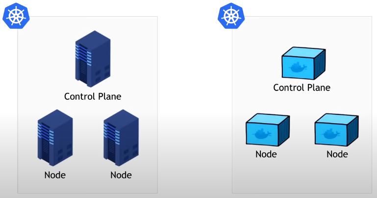
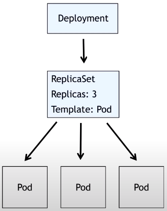
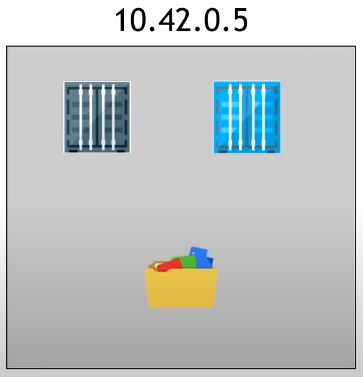
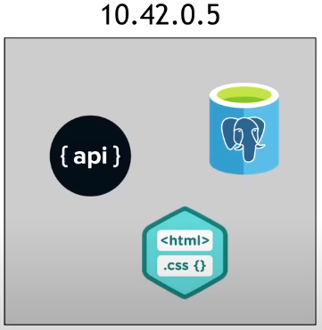
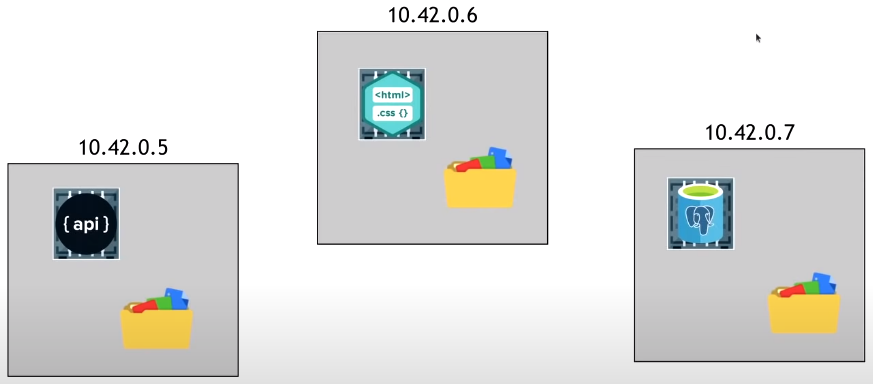
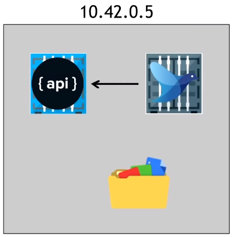
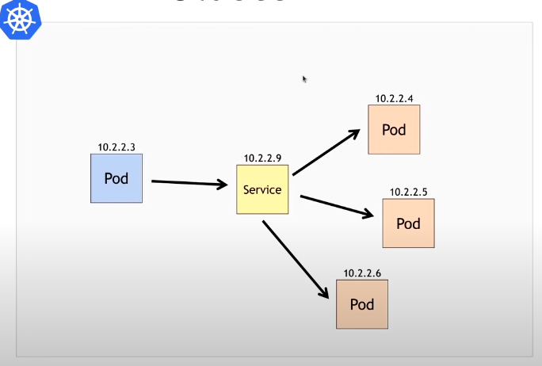
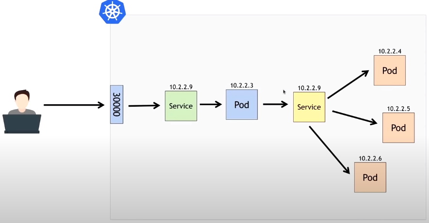
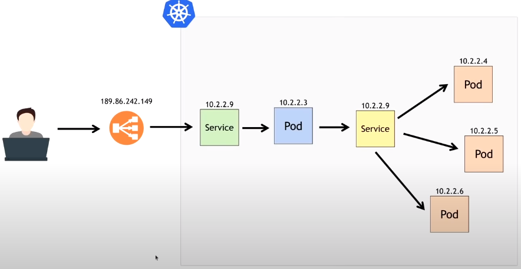
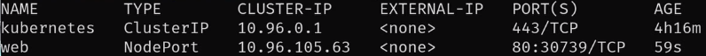

# AULA 2 - DESVENDANDO O KUBERNETES

### Kubernetes

* **Problemas do Docker solucionados**

  * Orquestração de containers

  * Automatização de processos

* **Vantagens**

  * Resiliência e escalabilidades nas aplicações (evitar queda da aplicação)

  * Balanceamento de cargas entre as réplicas, no momento de escalagem da aplicação (evitar a sobrecarga em uma das réplicas)

  * *Service discovery* = cataloga os endereços do local onde cada processo foi enviado 

  * Recurso de *self healing* = verificação do status dos containers (reinício do container em caso de problema)

  * Existência de estratégias de atualizações para evitar *downtime* (fora do ar)

* **Casos de uso**

  * Aplicações que exigem alta disponibilidade (**não podem cair**)

    * **Exemplo**: internet banking, e-commerce, gateway de pagamento

  * Microsserviços

  * Aplicações monolitos centradas em uma única ferramenta

* **Estrutura**

  * **Definição**

    * Formado por 1 *cluster* (conjunto de máquinas), nos quais cada máquina exerce um papel (**Control Plane** ou **Node**)
    
    * **Node**: responsável pela execução dos containers das aplicações

    * **Control Plane**: gerência os **nodes** e orquestra todo o *cluster*

  * **Conceitos**

    * **Kubernetes Control Plane** (gerência o *cluster* Kubernetes)

      * **Kube API Server** = responsável pela comunicação do *cluster* do o "client" (CLI ou outro Kube API Server)

      * **ETCD** (banco de dados "chave-valor") =  armazenamento de dados do Kubernetes

        > OBS: a coleta dos dados **nunca** é feita diretamente com o ETCD. O Kube API Server tem a função de fazer a comunicação entre "DB" e "Client" 

      * **Kube Scheduler** = responsável pela alocação e execução de cada processo

      * **Kube Controller Manager** = execução e gerenciamento dos controladores do Kubernetes (tomada de decisões)

    * **Kubernetes Node**

      * **Kubelet** = monitoramento (reportes de status para o Kube API Server) e execução dos containers no **node**

      * **Kube Proxy** = responsável pelas comunicações de rede com o *cluster*

      * Container Runtime Interface (**CRI**) = armazenamentos de especificações necessárias, dos containers, para ser utilizado dentro do Kubernetes

  * **OBS**: **Docker descontinuado como CRI no Kubernetes 1.20**

    * **Motivo**: Docker utilizado o **Dockershim** como adaptador entre a interface do **CRI** com a do **Docker**

    * **Solução**: utilizar outras tecnologias (*container-d* ou *Cri-o*) ao utilizar o Kubernetes

* **Formas de criar um cluster Kubernetes**

  * **On-premisse**

    * **Definição**: criação (do zero) de cluster Kubernetes em máquinas físicas ou virtuais

    * **Casos de uso**

      * Equipe com grande conhecimento em Kubernetes e Linux

      * Equipes de médio/grande porte

    * **Vantagem**: pleno controle sobre os clusters Kubernetes

    * **Desvantagem**: pleno controle sobre os clusters Kubernetes -> gestão e manutenção das máquinas/sistema operacionais/Kubernetes

    * **Ferramentas**

      * Kubeadm

      * Kubespray

      * RKE

      * K3S

      * MicroK8S

  * **Kubernetes as a service**

    * **Definição**: a gestão e criação dos cluster Kubernetes são feitos pelo serviços de nuvem

    * **Vantagem**: ganho em produtividade (o tempo gasto em configuração e manutenção do cluster pode ser utilizado para outras finalidades)

    * **Desvantagem**: perda do controle sobre os clusters Kubernetes

    * **Ferramentas**

      * AKS (Azure)

      * EKS (AWS)

      * GKS (Google)

  * **Local**

    * **Definição**: a gestão e criação dos cluster Kubernetes são feitos localmente (ambiente de desenvolvimento)

    * **Vantagem**: agilidade no deploy das aplicações (toda a configuração dos clusters já foram feitas localmente)

    * **Ferramentas**

      * Minikube

      * Kind

      * K3D

      * MicroK8S

      * K3S

    * **IMPORTANTE**: **nunca** utilizar essas ferramentas em ambiente de produção

### Docker swarm

* É um orquestrador de container, porém possuí muitas limitações comparado ao Kubernetes

### k3d

> **k3d** = versão do k3s para rodar em containers, ou seja, cada **node** do *cluster* é um container (+ rápido e leve)

* **Instalação do k3d**: `$ curl -s https://raw.githubusercontent.com/rancher/k3d/main/install.sh | bash`

* **Instalação do Kubectl**: 

  * `$ curl -LO "https://dl.k8s.io/release/$(curl) -L -s https://dl.k8s.io/release/stable.txt)/bin/linux/amd64/kubectl"`

  * `$ sudo install -o root -g root -m 0755 kubectl /usr/local/bin/kubectl`

  * **Configuração do Zsh (autocomplete)**

    * `$ code ~/.zshrc`

    * Adicionar: `source <(kubectl completion zsh)`

* **Comandos**

  * **Criação de um *cluster* Kubernetes com 1 node**

    * Sintaxe: `$ k3d cluster create <nome>`

    * Exemplo: `$ k3d cluster create meuprimeirocluster`

  * **Visualizar todos os nodes do *cluster* Kubernetes**

    * Sintaxe: `$ kubectl get nodes`

  * **Listagem dos containers utilizados para a criação do *cluster* Kubernetes**

    * Sintaxe: `$ docker container ls -a`

  * **Criação de um *cluster* Kubernetes sem *load balancer***

    > Utilizar esse comando **apenas** em clusters com apenas **1 node**

    * Sintaxe: `$ k3d cluster create <nome> --no-lb`

    * Exemplo: `$ k3d cluster create meusegundocluster --no-lb`

  * **Listagem dos *clusters*  Kubernetes**

    * Sintaxe: `$ k3d cluster list`

      > **Servers** = *Control Planes*

      > **Agents** = **nodes**

  * **Listagem de Pod, Services, Deployment, ReplicaSet**: `$ kubectl get all`

  * **Remoção de um *cluster* kubernetes**

    * Sintaxe: `$ k3d cluster delete <cluster>`

    * Exemplo: `$ k3d cluster delete meuprimeirocluster`

  * **Criação de um _cluster_ com x server e y agents**

    > Lembrando: **server** = _control plane_ | **agents** = _node_

    * Sintaxe: `$ k3d cluster create <nome> --servers <número> --agents <número>`

    * Exemplo: `$ k3d cluster create meucluster --servers 3 --agents 3` 

  * Iniciar um _cluster_ Kubernetes

    * Sintaxe: `$ k3d cluster start <nome>`

    * Exemplo: `$ k3d cluster start meucluster`

  * Parar um _cluster_ Kubernetes

    * Sintaxe: `$ k3d cluster stop <nome>`

    * Exemplo: `$ k3d cluster stop meucluster`

### Kind

> Kind = Kubernetes in Docker

* **Introdução**

  * Utiliza **container Docker**, diferentemente do cluster Kubernetes que usa máquinas físicas ou virtuais

    
  
  * **Vantagens**

    * Utiliza a tecnologia **Kubeadm** (muito utilizado em ambientes de produção)

    * Agilidade na criação dos clusters

    * Flexibilidade na criação dos clusters

* **Arquivo de configuração do Kind**

  * **Função**: especificar as configurações do cluster Kubernetes para o Kind

  * **Exemplo de configuração**

    ```yaml
    # nome do arquivo = cluster.yaml
    kind: Cluster
    apiVersion: kind.x-k8s.io/v1alpha4
    nodes: # definir os nodes do cluster
      - role: control-plane # especificar, para o Kind, o "papel" (função) do node como "control-plane
      - role: control-plane
      - role: control-plane
      - role: worker # especificar, para o Kind, o "papel" (função) do node como "worker"
      - role: worker
      - role: worker
        extraPortMappings: # binding de portas entre a  local e o container
          - containerPort: 30000
            hostPort: 8080
    ```

    > A partir desse arquivo de configuração, o Kind criará um cluster Kubernetes com 3 nodes *Control Plane* e 3 nodes *Worker* 

    * **Importante**: definir a regra de binding de portas (`extraPortMappings)` sempre em um node com o "papel" (`role`) de *Worker*. Isso evita problemas de acesso, quando for especificada em um *Control Plane*

* **Comandos**

  * **Criar um cluster Kubernetes**

    * **Sintaxe**: `$ kind create cluster`

    * **Exemplo**: `$ kind create cluster`

    * **OBS**

      * Ao utilizar esse comando, o Kind já configura o **kubectl context** (configuração necessária para o KubeCTL acessar o cluster Kubernetes)

        > As configurações do KubeCTL estão em `~/.kube/config`

      * Quando um cluster Kubernetes tem mais de 1 *Control Plane*, o Kind configura um *load balancer* (responsável por balancer a carga entre os nodes disponíveis)

    * **Flags**

      * `--name`

        * **Função**: especificar um nome ao cluster Kubernetes

        * **Sintaxe**: `$ kind create cluster --name <nome do cluster>`

        * **Exemplo**: `$ kind create cluster --name meucluster`

      * `--config`

        * **Função**: especificar um arquivo de configuração ao Kind para a criação do cluster Kubernetes

        * **Sintaxe**: `$ kind create cluster --config <nome do arquivo de configuração>`

        * **Exemplo**: `$ kind create cluster --name meucluster --config cluster.yaml`

  * **Listagem dos cluster Kubernetes criados pelo Kind**

    * **Sintaxe**: `$ kind get clusters`

    * **Exemplo**: `$ kind get clusters`

  * **Remover um cluster Kubernetes**

    * **Sintaxe**: `$ kind delete cluster`

    * **Exemplo**: `$ kind delete cluster`

    * **Flags**

      * `--name`

        * **Sintaxe**: `$ kind delete cluster --name <nome do cluster>`

        * **Exemplo**: `$ kind delete cluster --name meucluster`

### KubeCTL

* **Comandos**

  * **Listagem dos nodes do cluster Kubernetes**

    * **Sintaxe**: `$ kubectl get nodes`

    * **Exemplo**: `$ kubectl get nodes`

  * **Listagem dos pods do cluster Kubernetes**

    * **Sintaxe**: `$ kubectl get pods`

    * **Exemplo**: `$ kubectl get pods`

  * **Aplicar um arquivo de configuração de um objeto Kubernetes no cluster**

    * **Sintaxe**
    
      * `$ kubectl apply -f <caminho do arquivo>`

      * `$ kubectl create -f <caminho do arquivo>`

    * **Exemplo**: `$ kubectl create -f meupod.yaml`
  
  * **Exibir mais informações de um Pod em execução**

    * **Sintaxe**: `$ kubectl describe pod <nome do Pod>`

    * **Exemplo**: `$ kubectl describe pod meupod`

  * **Exibir mais informações de um ReplicaSet em execução**

    * **Sintaxe**: `$ kubectl describe replicaset <nome do Pod>`

    * **Exemplo**: `$ kubectl describe replicaset meureplicaset`

  * **Binding de portas entre a da máquina e do Pod (redirecionamento)**

    * **Sintaxe**: `$ kubectl port-forward pod/<nome do Pod> <porta local>:<porta Pod>`

    * **Exemplo**: `$ kubectl port-forward pod/meupod 8080:80`

  * **Excluir um Pod do cluster Kubernetes**

    * **Sintaxe**: `$ kubectl delete pod <nome do Pod>`

    * **Exemplo**: `$ kubernetes delete pod meupod`

  * **Listagem dos pods com um determinado *label***

    * **Sintaxe**: `$ kubectl get pods -l <chave do label>=<valor do label>`

    * **Exemplo**: `$ kubectl get pods -l app=web`

  * **Visualizar as versões do Deployment**

    * **Sintaxe**: `$ kubectl rollout history deployment <nome do deployment>`

    * **Exemplo**: `$ kubectl rollout history deployment meudeployment`

  * **Realizar o rollback de um Deployment**

    * **Sintaxe**: `$ kubectl rollout undo deployment <nome do deployment>`

    * **Exemplo**: `$ kubectl rollout undo deployment meudeployment`

### Deploy de um *cluster* Kubernetes

* **Conceito: os 3 objetos de deploy do Kubernetes**

  

  * **Pod**

    * **Definição**: menor objeto do cluster Kubernetes**

    * **Função**: gerenciamento dos containers (1 ou + )

      > Esses containers podem dividem o mesmo IP e mesmo arquivo de sistema (file system) do **Pod** (compartilhamento de recursos)

    * **Representação**

      

    * **Abordagens da criação dos Pods**

      * **Abordagem ERRADA**

        > Colocar todos os container de um aplicação em 1 **Pod**?

        

        * Dessa forma, isso se torna um aplicação monolítica (tudo em 1 único processo)

        * Na criação de réplicas de um *cluster* Kubernetes, há a **criação de réplicas do Pod** e não de container

        * Se colocar todos os container de uma aplicação em um mesmo **Pod**, na replicação, toda a aplicação será replicado . Com isso há **perdas na escalabilidade**.

      * **Abordagem CORRETA**

        

        * Colocar cada serviço em um Pod

        * A escalagem da aplicação é feita de forma individual

    * **Sidecar pattern**

      * **Introdução**: amplamente utilizado em ferramentas de **Service Mesh**

      * **Função**: criação de containers auxiliares a um container principal

      * **Exemplo**

        

        * **Container API**: container principal

        * **Container Logs**: container auxiliar

      * **Referência**: [medium](https://medium.com/bb-tutorials-and-thoughts/kubernetes-learn-sidecar-container-pattern-6d8c21f873d)

    * **Limitações**

      * Não tem a capacidade de fornecer resiliência e escalabilidade, por ser o menos objeto do _cluster_

        > O **Pod** ao ser removido, ele não é recriado (não tem resiliência)

      * Não é possível criar réplicas de Pod através do arquivo manifesto

    * **Arquivo de configuração do Pod**

      ```yaml
      apiVersion: v1
      kind: Pod
      metadata:
        name: meupod
        labels:
          app: web
      spec:
        containers: 
          - name: web
            image: kubedevio/web-page:blue
            ports:
              - containerPort: 80
      ```

      * `apiVersion`

        * **Função**: **especificar o grupo de recursos** (grupo de APIs), do Kubernetes, a ser utilizado na criação do objeto (nesse caso Pod)

        > OBS: `$ kubectl api-resources`: visualizar as versões das APIs disponíveis no Kubernetes

      * `kind`

        * **Função**: especificar o **tipo do objeto** Kubernetes

      * `metadata`

        * **Função**: definir os metadados do objeto

        * **Metadados**

          * `name`: nome do Pod

      * `spec`

        * **Função**: definir as especificações do objeto

        * **Especificações**

          * `containers`

            * **Função**: definir as configurações do(s) container(s) presente(s) de um Pod

            * **Opções de configuração**

              * `name`: nome do container

              * `image`: imagem Docker utilizada para a execução do container

              * `ports`: porta(s) exposta(s) do container

      * `labels`

        * **Função**: definir uma categoria/grupo no qual esse objeto pertence

  * **ReplicaSet**

    * **Definição**: garante a escalabilidade (criação de réplicas) e resiliência (recriar os Pods eliminados) dos **Pods**

    * **Função**: controlar, de forma declarativa, o número de réplicas de um determinado **Pod** no cluster Kubernetes (`replicas desejadas == replicas corrente`)

    * **Arquivo de configuração do ReplicaSet**

      ```yaml
      apiVersion: apps/v1
      kind: ReplicaSet
      metadata:
        name: meureplicaset
      spec:
        replicas: 1
        selector:
          matchLabels:
            app: web
        template:
          metadata:
            labels:
              app: web
          spec:
            containers: 
              - name: web
                image: kubedevio/web-page:blue
                ports:
                  - containerPort: 80
      ```

      * `apiVersion`

        * **Função**: **especificar o grupo de recursos** (grupo de APIs), do Kubernetes, a ser utilizado na criação do objeto (nesse caso apps/v1)

        > OBS: `$ kubectl api-resources`: visualizar as versões das APIs disponíveis no Kubernetes

      * `kind`

        * **Função**: especificar o **tipo do objeto** Kubernetes (nesse caso ReplicaSet)

      * `metadata`

        * **Função**: definir os metadados do objeto

        * **Metadados**

          * `name`: nome do ReplicaSet

      * `spec`

        * **Função**: definir as especificações do objeto

        * **Especificações**

          * `replicas`

            * **Função**: número de réplicas do Pod gerenciado pelo ReplicaSet

          * `selector`

            * **Função**: indicar ao ReplicaSet os Pods que serão gerenciados por ele a partir de um label 

            > **OBS**: o label do seletor deve ser igual ao label do **Template Pod**

          * `template`

            * **Função**: definir o template do Pod quer será monitorado pelo ReplicaSet

            * **Opções de configuração**

              * Os metadados (`metadata`) do Pod

              * As especificações (`spec`) do Pod

      * `labels`

        * **Função**: definir uma categoria/grupo no qual esse objeto pertence

  * **Deployment**

    * **Definição**: gerenciador de ReplicaSets

    * **Função**: toda vez que ocorrer uma alteração no **template** de um **Pod** (alteração na versão ou no comportamento), o **Deployment** recriará um novo ReplicaSet (com os novos **templates**)

      > A troca entre as versões de um ReplicaSet é feita de forma progressiva

    * **Vantagens**

      * Escalabilidade

      * Resiliência

      * Troca de versão automatizada (**garantia de downtime 0**)

        * **OBS**: as versões anteriores do Deployment são salvas (porém inativas) afim de possibilitar o gerenciamento de versão (e possivelmente de fazer um rollback)

    * **Arquivo de configuração do ReplicaSet**

      ```yaml
      apiVersion: apps/v1
      kind: Deployment
      metadata:
        name: meudeployment
      spec:
        replicas: 1
        selector:
          matchLabels:
            app: web
        template:
          metadata:
            labels:
              app: web
          spec:
            containers: 
              - name: web
                image: kubedevio/web-page:blue
                ports:
                  - containerPort: 80
      ```

      * `apiVersion`

        * **Função**: **especificar o grupo de recursos** (grupo de APIs), do Kubernetes, a ser utilizado na criação do objeto (nesse caso apps/v1)

        > OBS: `$ kubectl api-resources`: visualizar as versões das APIs disponíveis no Kubernetes

      * `kind`

        * **Função**: especificar o **tipo do objeto** Kubernetes (nesse caso Deployment)

      * `metadata`

        * **Função**: definir os metadados do objeto

        * **Metadados**

          * `name`: nome do Deployment

      * `spec`

        * **Função**: definir as especificações do objeto

        * **Especificações**

          * `replicas`

            * **Função**: número de réplicas do Pod gerenciado pelo ReplicaSet

          * `selector`

            * **Função**: indicar ao ReplicaSet os Pods que serão gerenciados por ele a partir de um label 

            > **OBS**: o label do seletor deve ser igual ao label do **Template Pod**

          * `template`

            * **Função**: definir o template do Pod quer será monitorado pelo ReplicaSet

            * **Opções de configuração**

              * Os metadados (`metadata`) do Pod

              * As especificações (`spec`) do Pod

      * `labels`

        * **Função**: definir uma categoria/grupo no qual esse objeto pertence

      > **OBS**: a criação do ReplicaSet é feito implicitamente pelo Deployment


* **Nomenclatura dos objetos Kubernetes**

  * A geração dos nomes é feito de **forma dinâmica** (aleatório), porém cada objeto tem um padrão de nomenclatura

  * **Padrão de nomenclatura**

    * **Pod**

      * `<nome do Pod>`

    * **ReplicaSet**

      * `<nome do Deployment>-<nome aleatório do Pod>`

        * Nome do Pod gerado aleatoriamente possui 5 caracteres

    * **Deployment**

      * `<nome do Deployment>-<nome aleatório do ReplicaSet>-<nome aleatório do Pod>`

        * Nome do ReplicaSet, gerado aleatoriamente, possui 9 caracteres

        * Nome do Pod, gerado aleatoriamente, possui 5 caracteres


### Arquivo de manifesto de um **Pod**

* **Definição**
  
  * Sempre necessário quando for utilizar o Kubernetes

  * Arquivo em formato YAML

* **Função**: definir todas as configurações de um objeto

* **Campos obrigatórios na criação de um manifesto**

  * **apiVersion**
  
    * Função: definir o agrupamento de API, ou seja, a separação de alfa, beta, pertence a um recurso específico ou recurso final
    
    * Sintaxe: `apiVersion: valor`

    * Exemplo: `apiVersion: v1`

    > Qual apiVersion utilizar? `$ kubectl api-resources`

  * **kind**

    * Função: definir o objeto a ser declarado

    * Sintaxe: `kind: valor`

    * Exemplo: `kind: Pod`

  * **metadata**

    * Função: definir os metadados do objeto

    * Definir o nome do objeto

      * Sintaxe 

        ```yml
        metadata:
          name: valor
        ```

      * Exemplo

        ```yml
        metadata:
          name: meupod
        ```

  * **spec**

    * Função: definir a especificação do objeto

    * Definir o(s) container(s) à serem executados

      * Sintaxe

        ```yml
        spec:
          containers:
            # configurações do(s) container(s)
        ```

      * Exemplo

        ```yml
        spec:
          containers:
            - name: site
              image: kubedevio/nginx-color:blue
              ports:
                - containerPort: 80
        ```

* **Comandos**

  * **Criar o objeto no _cluster_ Kubernetes**

    * Sintaxe: `$ kubectl create -f <arquivo manifesto>`

    * Exemplo: `$ kubectl create -f ./meupod.yml`

  * **Remover o objeto do _cluster_ Kubernetes**

    * Sintaxe

      * `$ kubectl delete -f <arquivo manifesto>`

      * `$ kubectl delete pod <nome>`

    * Exemplo: `$ kubectl delete -f meupod.yml`

  * **Visualizar o objeto no _cluster_ Kubernetes**

    * Sintaxe: `$ kubectl get pods`

  * **Visualizar mais detalhes do objeto no _cluster_ Kubernetes**

    * Sintaxe: `$ kubectl describe pod <arquivo manifesto>`

    * Exemplo> `$ kubectl describe pod meupod`

  * **Binding da porta da maquina local com a porta do Pod (container em execução no Pod)** 

    * Sintaxe: `$kubectl port-forward <pod>/<nome do pod> <porta maquina local>:<porta Pod>`

    * Exemplo: `$ kubectl port-forward pod/meupod 8080:80`

  * Listagem dos pods com um output mais detalhado (**wide**): `$ kubectl get pods -o wide`

### Arquivo de manifesto de um **ReplicaSet**

* **Campos obrigatórios na criação de um manifesto**

  * **apiVersion**
    
    * Função: definir o agrupamento de API, ou seja, a separação de alfa, beta, pertence a um recurso específico ou recurso final
    
    * Sintaxe: `apiVersion: app/valor`

    * Exemplo: `apiVersion: apps/v1`

    > Qual apiVersion utilizar? `$ kubectl api-resources`

  * **kind**

    * Função: definir o objeto a ser declarado

    * Sintaxe: `kind: valor`

    * Exemplo: `kind: ReplicaSet`

  * **metadata**

    * Função: definir os metadados do objeto

    * Definir o nome do objeto

      * Sintaxe 

        ```yml
        metadata:
          name: valor
        ```

      * Exemplo

        ```yml
        metadata:
          name: meureplicaset
        ```

  * **spec**

    * Função: definir a especificação do objeto

    * Definir o **selector**

      * Sintaxe

        ```yml
        spec:
          selector:
            matchLabels:
              app: valor
        ```

      * Exemplo

        ```yml
        spec:
          selector:
            matchLabels:  
              app: nginx
        ```

    * Definir o **template**

      * Sintaxe

        ```yml
        spec:
          template:
            # configurações do Pod (metadados e specs)
        ```

      * Exemplo

        ```yml
        spec:
          template:
            metadata:
              labels:
                app: nginx
            spec:
              containers:
                - name: site
                  image: kubedevio/nginx-color:blue
                  ports:
                    - containerPort: 80
        ```

  * **Arquivo final**

    ```yaml
    apiVersion: apps/v1
    kind: ReplicaSet
    metadata:
      name: meureplicaset
    spec:
      replicas: 10
      selector:
        matchLabels:  
          app: nginx
      template:
        metadata:
          labels:
            app: nginx
        spec:
          containers:
            - name: site
              image: kubedevio/nginx-color:green
              ports:
                - containerPort: 80
    ```

* **Verificação**

  * **Verificar a escalabilidade de um ReplicaSet**

    * Arquivo manifesto do ReplicaSet

      * Sintaxe

        ```yaml
        spec:
          replicas: valor
        ```

      * Exemplo
      
        ```yaml
        spec:
          replicas: 10
        ```

    * **OBS**: é possível definir o número de ReplicaSet através da linha de comando

      * Sintaxe: `$ kubectl scale replicaset <nome> --replicas <quantidade>`

      * Exemplo: `$ kubectl scale replicaset meureplicaset --replicas 20`

    * Recriar o ReplicaSet (`$ kubectl apply -f <arquivo manifesto>`)

  * **Verificar a resiliência do ReplicaSet**

    * Remover um das réplicas (Pod) criada pelo ReplicaSet (`$ kubectl delete pod <nome>`)

    * Verificar se o ReplicaSet criou um novo Pod para substituir o Pod removido (`$ kubectl get pods`)

* **Comandos**

  * **Criar o ReplicaSet**:

    * Sintaxe: `$ kubectl apply -f <arquivo manifesto>`

    * Exemplo: `$ kubectl apply -f ./meureplicaset.yml`

  * **Listagem dos ReplicaSets**: `$ kubectl get replicaset`

    * **DESIRED** = número de réplicas desejada

    * **CURRENT** = número de réplicas em execução

    * **READY** = número de réplicas prontas

    * **AGE** = tempo de vida (em segundos)

  * **Visualizar mais informações sobre um ReplicaSet**

    * Sintaxe: `$ kubectl describe replicaset <nome>`

    * Exemplo: `$ kubectl describe replicaset meureplicaset`

### Arquivo de manifesto de um **Deployment**

* **Campos obrigatórios na criação de um manifesto**

  * **apiVersion**
    
    * Função: definir o agrupamento de API, ou seja, a separação de alfa, beta, pertence a um recurso específico ou recurso final
    
    * Sintaxe: `apiVersion: app/valor`

    * Exemplo: `apiVersion: apps/v1`

    > Qual apiVersion utilizar? `$ kubectl api-resources`

  * **kind**

    * Função: definir o objeto a ser declarado

    * Sintaxe: `kind: valor`

    * Exemplo: `kind: Deployment`

  * **metadata**

    * Função: definir os metadados do objeto

    * Definir o nome do objeto

      * Sintaxe 

        ```yml
        metadata:
          name: valor
        ```

      * Exemplo

        ```yml
        metadata:
          name: meudeployment
        ```

  * **spec**

    * Função: definir a especificação do objeto

    * Definir o **selector**

      * Sintaxe

        ```yml
        spec:
          selector:
            matchLabels:
              app: valor
        ```

      * Exemplo

        ```yml
        spec:
          selector:
            matchLabels:  
              app: nginx
        ```

    * Definir o **template**

      * Sintaxe

        ```yml
        spec:
          template:
            # configurações do Pod (metadados e specs)
        ```

      * Exemplo

        ```yml
        spec:
          template:
            metadata:
              labels:
                app: nginx
            spec:
              containers:
                - name: site
                  image: kubedevio/nginx-color:blue
                  ports:
                    - containerPort: 80
        ```

  * **Arquivo final**

    ```yaml
    apiVersion: apps/v1
    kind: Deployment
    metadata:
      name: meudeployment
    spec:
      replicas: 10
      selector:
        matchLabels:  
          app: nginx
      template:
        metadata:
          labels:
            app: nginx
        spec:
          containers:
            - name: site
              image: kubedevio/nginx-color:green
              ports:
                - containerPort: 80
    ```

* **Comandos**

  * **Criar um Deployment**

    * Sintaxe: `$ kubectl apply -f <arquivo manifesto>`

    * Exemplo: `$ kubectl apply -f ./meudeployment.yml`

  * **Listagem dos Deployments**: `$ kubectl get deployment`

    * **READY** = número de réplicas prontas

    * **UP-TO-DATE** = número de réplicas atualizadas

    * **AVAILABLE** = número de replicas disponíveis

    * **AGE** = tempo de vida (em segundos)

  * **Dar um rollback para versão anterior**

    * Sintaxe: `$ kubectl rollout undo deployment <nome>`

    * Exemplo: `$ kubectl rollout undo deployment meudeployment`

### Recursos: **label** e **selector**

* **IMPORTANTE**: todo relacionamento entre objetos do Kubernetes é feito a partir de **labels e selectors**

* **labels**

  * **Definição**: São atributos "chave-valor" utilizados para marcação no Kubernetes

* **selectors**

  * **Definição**: selecionar objetos no _cluster_ Kubernetes que possuem um determinado **label** ("chave-valor"), ou seja, cumprem com uma regra de seleção

* Adicionar um **label** no arquivo manifesto de um **Pod**

  * **Sintaxe**

    ```yml
    metadata:
      name: valor
      labels:
        app: valor
    ```

  * **Exemplo**

    ```yml
    apiVersion: v1
    kind: Pod
    metadata:
      name: meuseundopod
      labels:
        app: nginx
    spec:
      containers:
        - name: site
          image: kubedevio/nginx-color:blue
          ports:
            - containerPort: 80
    ```

* Visualizar o **Pod** com o um determinado label

  * **Sintaxe**: `$ kubectl get pods -l <label>`

  * **Exemplo**: `$ kubectl get pods -l app=nginx`

### Service Discovery no Kubernetes

* **Service do tipo ClusterIP**
    
  * **Representação**

    

  * **Função**: expor um **Pod** (aplicação) apenas de forma interna, ou seja, só pode ser acessado por dentro do cluster Kubernetes

  * **Caso de uso**: comunicação entre microsserviços

* **Service do tipo NodePort**

  * **Representação**

    

  * **Função**: expor um **Pod** (aplicação) de forma externa através de um porta, por padrão, gerada aleatoriamente.

    > **OBS**: a escolha da porta é aleatória, mas varia entre as portas 30000 e 32767 (**padrão**)

  * **Caso de uso**: ambientes Kubernetes On-premise (não possui um serviço de nuvem que forneça um IP)

* **Service do tipo LoadBalancer**

  * **Representação**

    

  * **Função**: responsável por gerar um IP público . A partir desse IP, será possível acessar o *Service* que por sua vez redirecionar para um Pod

    * **OBS**: nessa situação não ocorre a geração aleatório da porta, pois ela já é fornecida pelo LoadBalancer

  * **Geração aleatória da porta externa**

    * **Arquivo manifesto/configuração**

      ```yaml
      apiVersion: v1
      kind: Service
      metadata:
        name: web
      spec:
        selector:
          app: web
        ports:
          - port: 80
            protocol: TCP
            name: http
        type: NodePort
      ```

    * **Resultado**

      

      * **Ports**: `<porta interna>:<porta externa>/<protocolo>`

        * **Porta interna**: porta exporta do Pod

        * **Porta externa**: porta gerada aleatoriamente (entre 30000 e 32767) pelo Service do tipo NodePort

        * **Protocolo**: TCP (utilizado pelo HTTP) ou UDP

      * **OBS**: acessar o container

        * Obter o IP do container Docker

          * `$ docker container ls` -> pegar o ID de um container

          * `$ docker inspect <ID do container>` -> buscar pelo campo `IPAddress`

          * `$ kubectl get services` -> pegar a porta externa

          * Acessar no navegador -> `<IPAddress>:<porta externo>`

            * Exemplo: `172.18.0.5:30739`

  * **Especificar a porta externa**

    * **Arquivo manifesto/configuração**

      ```yaml
      apiVersion: v1
      kind: Service
      metadata:
        name: web
      spec:
        selector:
          app: web
        ports:
          - port: 80
            protocol: TCP
            name: http
            nodePort: 30000
        type: NodePort
      ```

* **Binding de porta entre a maquina local e o container**

  * Arquivo manifesto

    * Sintaxe

      ```yaml
      spec:
        ports:
          nodePort: valor
      ```

    * Exemplo

      ```yaml
      spec:
        ports:
          - port: 80
            nodePort: 30000
      ```

  * **Criar cluster com binding de portas**

    * Sintaxe: `$ k3d cluster create --servers <número> --agents <número> -p "<porta maquina local>:<porta node>@loadbalancer"`

    * Exemplo: `k3d cluster create --servers 1 --agents 2 -p "8080:30000@loadbalancer"`

* **Comandos**

  * **Listagem dos Services**: `$ kubectl get services`

### Projeto 

* **Criação do Dockerfile na pasta /src**

  ```dockerfile
  FROM python:3.8-slim-buster

  WORKDIR /app

  COPY requirements.txt .

  RUN python -m pip install -r requirements.txt

  COPY . .

  EXPOSE 5000

  # subir o servidor HTTP
  CMD ["gunicorn", "--workers=3", "--bind", "0.0.0.0:5000", "app:app"]
  ```

* **Criação da imagem v1 a partir do Dockerfile**: `$ docker build -t imgabreuw/rotten-potatoes:v1 .`

* **Fazer autenticação no Docker Hub**: `$ docker login`

* **Fazer o push da imagem v1 para o Docker Hub**: `$ docker push imgabreuw/rotten-potatoes:v1`

* **Criação da imagem latest a da v1**: `$ docker tag imgabreuw/rotten-potatoes:v1 imgabreuw/rotten-potatoes:latest`

* **Criação do cluster Kubernetes local com k3d**: `$ k3d cluster create meucluster --servers 1 --agents 2 -p "8080:30000@loadbalancer"`

* **Criação do manifesto do Deployment para o MongoDB**

  ```yaml
  apiVersion: apps/v1
  kind: Deployment
  metadata:
    name: mongodb
  spec:
    selector:
      matchLabels:
        app: mongodb
    template: # especificações do Pod mongodb
      metadata:
        labels:
          app: mongodb
      spec:
        containers:
          - name: mongodb
            image: mongo:4.4.6
            ports:
              - containerPort: 27017
            env:
              - name: MONGO_INITDB_ROOT_USERNAME
                value: mongouser
              - name: MONGO_INITDB_ROOT_PASSOWORD
                value: mongopwd
    ```

  * `$ kubectl create -f ./k8s/mongodb/deployment.yml`

* **Criação do manifesto Service para o MongoDB**

  ```yaml
  apiVersion: v1
  kind: Service
  metadata:
    name: mongo-service
  spec:
    selector:
      app: mongodb
    ports:
      - port: 27017
        targetPort: 27017
    type: ClusterIP
  ```

  * `$ kubectl apply -f ./k8s/mongodb/service.yml`

* **Criação do manifesto do Deployment e Service para a Web** (no mesmo arquivo)

  ```yml
  apiVersion: apps/v1
  kind: Deployment
  metadata:
    name: movies
  spec:
    selector:
      matchLabels:
        app: movies
    template:
      metadata:
        labels:
          app: movies
      spec:
        containers:
          - name: movies
            image: imgabreuw/rotten-potatoes:v1
            ports:
              - containerPort: 5000
            env:
              - name: MONGODB_DB
                value: admin
              - name: MONGODB_HOST
                value: mongo-service
              - name: MONGODB_PORT
                value: "27017"
              - name: MONGODB_USERNAME
                value: mongouser
              - name: MONGODB_PASSWORD
                value: mongopwd

  ---

  apiVersion: v1
  kind: Service
  metadata:
    name: movies-service
  spec:
    selector:
      app: movies
    ports:
      - port: 80
        targetPort: 5000
        nodePort: 30000
    type: NodePort
  ```

  * `$ kubectl apply -f ./k8s/web/deployment.yml`

* **Acessar**

  * Página inicial: http://localhost:8080/

  * Página para verificar a escalabilidade (nome do Pod): http://localhost:8080/host (`$ kubectl scale deployment movies --replicas <quantidade>`)