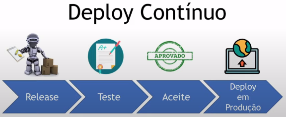

# Como gerar valor em uma entrega com pipeline CI/CD

### Pipeline

> **pipeline** é também chamado de **esteira**

* **Definição**: sequência de etapas de execução afim de automatizar algum processo

### CI

> **CI** = (C)ontinuos (I)ntegration (**Integração contínua**)

* **Representação**

  

* **Definição**

  * Consiste na integração de um "código novo" (nova funcionalidade) em uma aplicação por meios de uma sequência de etapas

  * Essas etapas são
    
    * **Teste unitário**

    * **Teste funcional**

    * **Teste de integração**

    * **Validação de código e qualidade**

    * **Segurança de código**

    * **Geração do artefato (pacote) de entrega**

### CD

> **CD** = (C)ontinuos (D)elivery (**Entrega contínua**)

* **Representação**

  

* **Definição**

  * Consiste na entrega contínua do "produto" (código) em um ambiente, após a realização das pipelines CI

  * É possível ter uma pipeline CD para cada ambiente (entrega, homologação, produção)

  * **Objetivo**: pegar o artefato, gerado na pipeline CI, e fazer o deploy do mesmo em um ambiente de produção

### Github Action

> Solução do GitHub para automatização de processos (CI/CD)

* **Workflow**

  * **Definição**: é uma rotina (pipelines) definida no repositório. Ele contêm Jobs e as definições dos eventos que irão dispará-lo.

  * **Componentes**

    * *Jobs*: sequência de etapas (pipeline) executada no Workflow de forma sequencial ou paralela

      > Quando um *Job* depende do outro, a execução é feita de forma sequencialmente, pois esse *Job* precisa do resultado (bem sucedido) do anterior

    * *Events*: estímulos ou ações que são responsáveis pelo disparo do *Workflow*

      > Alguns *Events*: pull request, push em uma branch, webhook de outro workflow

    * *Steps*: execuções de comandos (Shell ou PowerShell) ou de *Action*s dentro do **Job**, em shell, powershell ou actions

      > Por estarem no mesmo *Job*, as *Steps* compartilham dados entre si (**Exemplo**: arquivos)

    * *Actions*: instruções executadas através de blocos de configurações

      > É possível utilizar *Actions* já existentes na comunidade do GitHub

    * *Runners*: agentes de execução dos *Job*s

      > É possível utilizar os serviços disponibilizados pelo Github ou próprio


  * **Exemplo de um workflow**

    ```yml
    name: CI-CD # nome do workflow

    on: # eventos
      push: # disparo do evento quando dar um push em determinada(s) branche(s)
        branches: [ master ]
      pull_request: # disparo do evento quando fazer um pull request em determinada(s) branche(s)
        branches: [ master ]

      workflow_dispatch: # execução manual do workflow

    jobs:
      CI:
        runs-on: ubuntu-latest

        steps:
          - uses: actions/checkout@v2

          - name: Docker Login # configuração para autenticação no Docker Hub
            uses: docker/login-action@v1.10.0
            with:
              username: ${{ secrets.DOCKERHUB_USER }} # uso de secrets (armazenar dados sensíveis a partir de "chave-valor")
              password: ${{ secrets.DOCKERHUB_PWD }}

          - name: Build and push Docker images
            uses: docker/build-push-action@v2.6.1
            with: # parâmetros que serão utilizados para a criação da imagem a partir do Dockerfile
              context: ./src # Contexto
              file: ./src/Dockerfile # caminho até o Dockerfile
              push: true # fazer o push da imagem no Docker Hub
              tags: | # tags da imagem utilizada ("|" = continuar na próxima linha)
                imgabreuw/rotten-potatoes:latest
                imgabreuw/rotten-potatoes:${{ github.run_number }}

      CD:
        runs-on: ubuntu-latest 
        needs: [CI] # Cd só será executado após a CI ser concluído
        
        steps:
          - uses: actions/checkout@v2
          
          - name: Kubernetes set context
            uses: Azure/k8s-set-context@v1.1
            with:
              method: kubeconfig # método de autenticação para definir o contexto no cluster
              kubeconfig: ${{ secrets.K8S_CONFIG }}
    ```

    * **Para adicionar um secret**: 

### Digital Ocean

> **IMPORTANTE**: desligar e remover o _cluster_ após sua utilização

* **Etapas de criação do cluster Kubernetes**

  * 1º) Ir para: `painel da DigitalOcean > Manage > Kubernetes > Create > Kubernetes` 

  * 2º) Definir a versão do Kubernetes
  
    

  * 3º) Escolher a região do cluster

    

  * 4º) Configurar os recursos da máquina (node)

    

  * 5º) Definir o nome do cluster

    

  * 5º) Clicar no botão: `Create Cluster`

  * 6º) Clicar no botão: `Download Config File` (em `Access cluster config file`)

  * 7º) Sobrescrever as configurações de contexto do KubeCTL (arquivo em `~/.kube/config`)

    * `$ cp ~/Downloads/<arquivo de configuração> ~/.kube/config`

      > `arquivo de configuração`: arquivo baixado na Digital Ocean (contêm as informações do cluster da Digital Ocean)